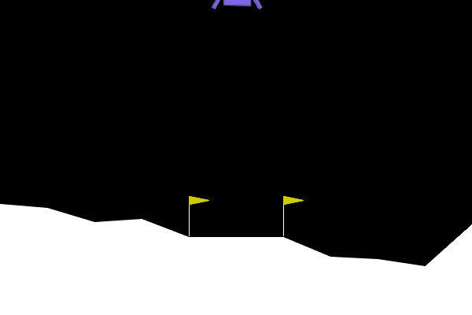

# LunarLander-v3 DQN Agent

A PyTorch implementation of a Deep Q-Network (DQN) agent trained to solve the LunarLander-v3 environment from Gymnasium.

---

## Project Overview

This repository contains a Deep Reinforcement Learning agent utilizing PyTorch to solve the LunarLander-v3 environment provided by OpenAI Gymnasium. The agent is based on the DQN algorithm with experience replay, target networks, and epsilon-greedy exploration strategy.

---

## Requirements

Ensure you have the following installed:

- Python >= 3.8
- PyTorch
- Gymnasium
- NumPy
- Imageio

The resulting GIF (`lunarlander_test.gif`) demonstrates the trained agent's performance.

---

## Model Architecture

The neural network architecture used is a simple Multi-Layer Perceptron (MLP):

- **Input Layer:** 8-dimensional state space
- **Hidden Layers:** 2 fully-connected layers (128 neurons each) with ReLU activation
- **Output Layer:** 4 neurons corresponding to the discrete actions

---

## Hyperparameters

| Parameter       | Value   |
|-----------------|---------|
| Learning Rate   | 1e-3    |
| Gamma           | 0.99    |
| Replay Buffer   | 100,000 |
| Batch Size      | 64      |
| Epsilon Decay   | 0.995   |
| Target Update   | 10 episodes |

---

## Results

Training typically achieves consistent successful landings after ~950 episodes. Below is a representative performance:

---

## Improvements & Future Work

Possible enhancements include:
- Double DQN
- Dueling Network
- Prioritized Experience Replay
- Rainbow DQN Implementation

---
